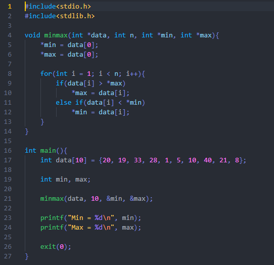

# Algoritmo e Estrutura de Dados  
  25/05/2021  
  
  Jorge Vitor Gonçalves de Souza
  
# MinMax  

  Ao realizar a troca do segundo "if" do código por um "else if" ocorrerá uma melhora no desempenho do 
  algoritmo no melhor caso e no caso médio.

  

# Melhor Caso

  Se o vetor analisado estiver organizado de maneira crescente, ou seja, o proximo número sempre será maior que o Max estabelecido anteriormente, dentro do "for" somente o "if" irá rodar todas as vezes, gerando um custo de (n - 1).

# Pior Caso 

  Se o vetor analisado estiver organizado de maneira decrescente, ou seja, o próximo número sempre será menor que o Min estabelecido anteriormente, dentro do "for" tanto o "if" quanto o "else if" serão executados todas as vezes, gerando o mesmo custo do código com dois "if": 2(n - 1).

# Caso Médio

  Um caso médio ideal é quando o "else if" for executado a metade das vezes em que o "if" foi executado, assim seria gerado um custo médio de (n - 1) + (n - 1)/2. 

